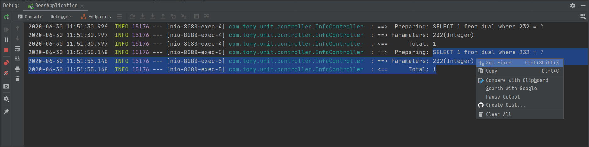
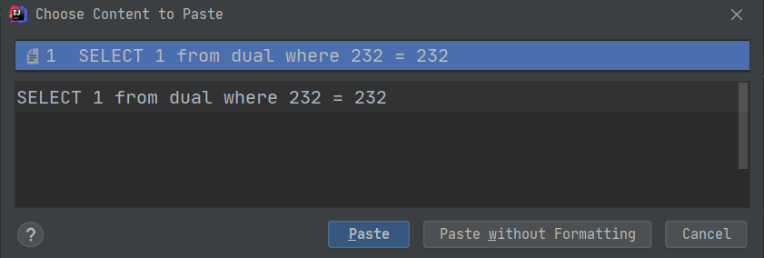

[中文文档](./README_CN.md)

# sql-fixer

Convenient copy of SQL from console logs in idea.

# General Usage Instructions
When debugging with idea, it is often necessary to check whether the sql in the log printed by the console can be executed correctly, but usually we can not directly execute the sql copy, we need to add the sql parameter value to the corresponding position one by one. This plug-in solves the function of automatically filling parameters when copying sql.

When in use, you only need to select the two lines of log information of the SQL statement line and the parameter line next to it and right-click the "Sql Fixer" option. At this time, the complete executable SQL statement is stored in your clipboard. , Then you can paste it anywhere.

If you can’t use it, you can tell me by creating a github issue or email (ittony.ma@gmail.com), no matter which way you use, please attach a sample log you can’t use, thank you!

# Example

1. Search for `sql fixer` in the "File -> Settings -> Plugins" plugin market in idea and install it.

2. Select the sql and parameter lines in your console and right-click on `Sql Fixer`.

   

3. At this point, the complete SQL has been copied to your system clipboard, and the ` ? ` in the original SQL has been replaced by the actual parameter value. You can use `Ctrl + Shift + V` to view in idea.

   

4. You can then paste the complete sql anywhere.

# Change-Notes
- 2020/7/31

  1. Release beta1.1.
  2. Support Long type Parameters.
  3. Fix Bug.

- 2020/6/29

  1. Add icon.
  2. Support parameters including json.
  3. Add keyboard-shortcut **Ctrl+Shift+X** .
  4. Fix Bug.

- 2020/6/28

  1. Release beta1 for testing.
