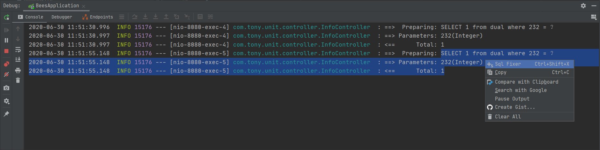
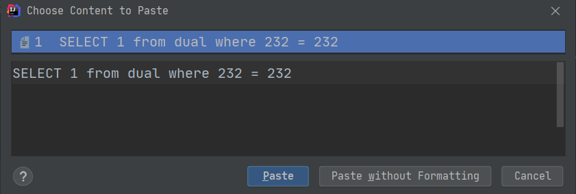

[English Document](./README.md)

# sql-fixer

从控制台日志方便地复制SQL。 

# 使用说明

使用idea调试的时候经常需要检查 console 打印的日志中的sql是否能正确执行，但是通常我们将sql拷贝出来是不能直接执行的，需要将sql的参数值一个一个的补充到对应的位置上。这个插件就是解决了拷贝sql时自动将参数填充的功能。

使用时，您仅仅只需要选中sql语句行与紧挨着的参数行这两行日志信息并右键点击"Sql Fixer" 选项，这时完整的可执行的sql语句就存放到了您的剪切板中，这时您就可以将它粘贴到任何地方。

如果您无法使用它，您可以通过创建 github issue 或者 电子邮件（ittony.ma@gmail.com）的方式告诉我，不管使用哪种方式，请附上您无法使用的示例日志，谢谢！

# 例子

1. 在 idea 中 `File -> Settings -> Plugins` 插件市场中搜索 sql fixer，并安装。

2. 在你的控制台中选中 sql 和 参数行，并右键点击 `Sql Fixer`.

   

3. 此时，完整的 sql 已经被复制到您的系统剪切板中，原 sql 中的问号已经被真实的参数值替换。您可以在 idea 中使用 `Ctrl + Shift + V` 查看 。

   

4. 接下来您可以将该完整 sql 粘贴到任何地方。

# 变更记录

- 2020/6/29

  1. 添加 icon.

  2. 支持参数值包含json字符串.
  3. 添加快捷键 **Ctrl+Shift+X** .
  4. 修复Bug.

- 2020/6/28

  1. 发布 beta1 版本.